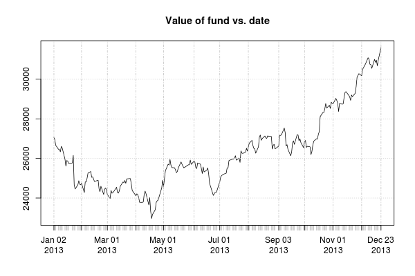

This is a demo for how to use R to make easy real-time plots of financial data. First we load the required libraries: 
```r
library(quantmod)
library(ggplot2)
```
Next, as an example, we can get Google stock prices from Yahoo finance:
```r
getSymbols('GOOG', src='yahoo')
```
Now we can plot data from 2013: 
```r
png('google.png', width=600, height=400)
barChart(GOOG['2013'])
dev.off()
```


Now, we can create a custom fund, with different numbers of shares for different stocks: 
```r
myshares=list(Google=50, Apple=25, Coke=30, GM=125, Exxon=45)
``` 
As before, we can grab the stock values from Yahoo finance:
```r
mysymbols=c('GOOG', 'AAPL', 'COKE', 'GM', 'XOM')
getSymbols(mysymbols, src='yahoo')
```
And now we can get a time series of our fund's value over the year: 
```r
myfund <- rep(0, dim(GOOG['2013'])[1])
mylist <- list(GOOG, AAPL, COKE, GM, XOM)
for (i in 1:length(mylist))  {
  myfund <- myfund + mylist[[i]]['2013'][, 4] * myshares[[i]] # weight by number of shares
}
png('myfund.png', width=600, height=400)
plot(myfund, main='Value of fund vs. date')
dev.off()
```


Expanding this so that the fund has different numbers of shares at different points in time or has things other than stock is straighforward. 

